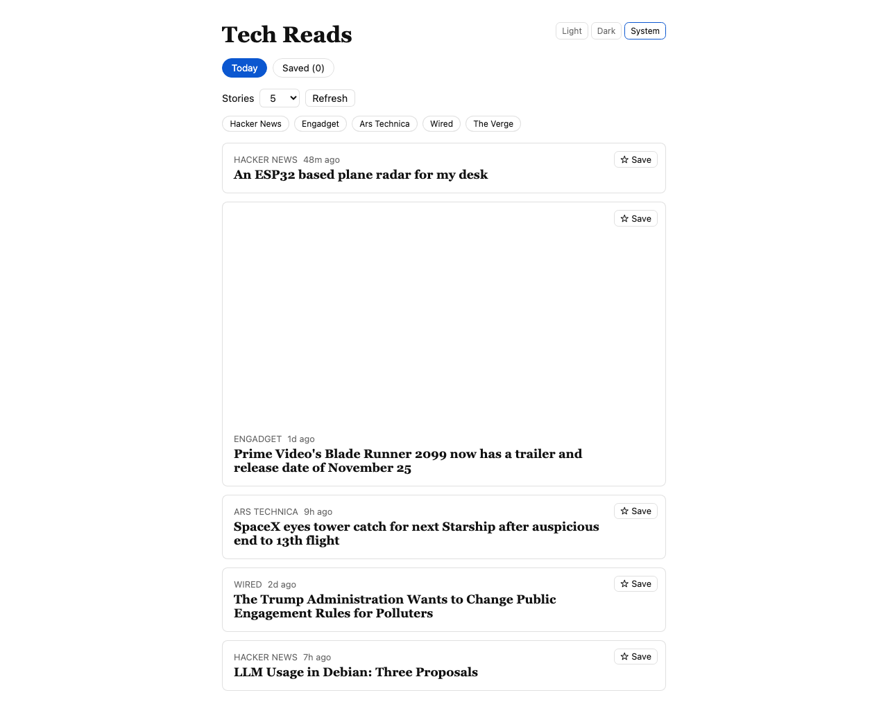
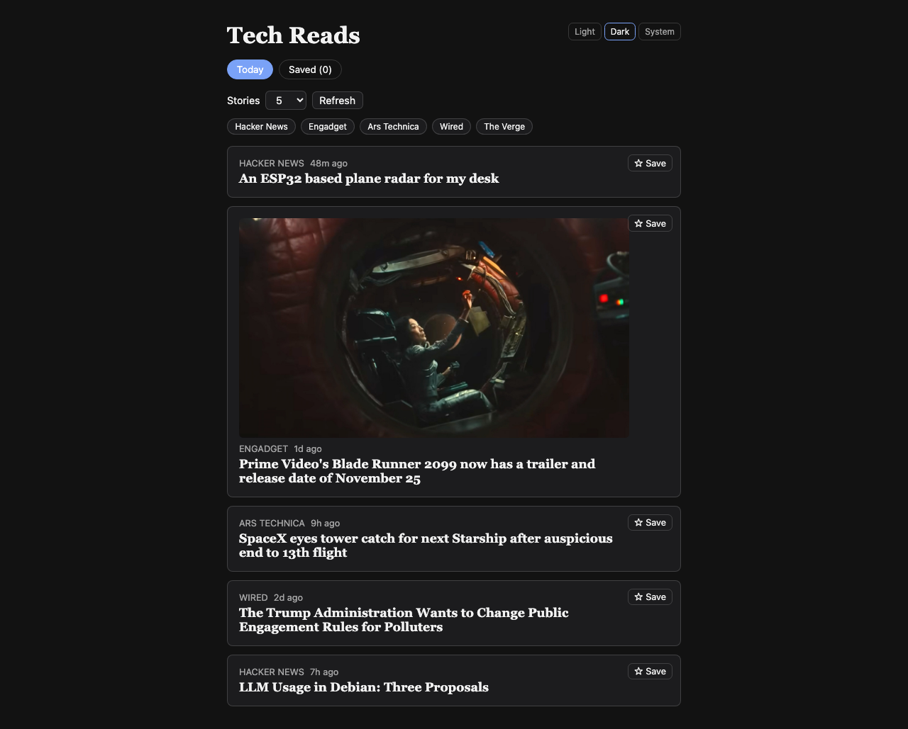

# Tech Reads

A daily tech news reader. Load up, pick from a handful of today's top stories pulled from
curated RSS feeds — with the option to jump to the original source when you want the full article.

**Live demo:** [techreads.joeybowser.com](https://techreads.joeybowser.com)

|                        Light                        |                        Dark                        |
| :---------------------------------------------------: | :---------------------------------------------------: |
|  |  |

## Features

- **Curated tech feed** — RSS from TechCrunch, The Verge, Ars Technica, Wired, Engadget, and
  Hacker News, deduped and cached server-side.
- **AI summaries, on demand** *(needs an Anthropic API key)* — opening a story can fetch the
  full article and generate a 3–5 sentence summary with Claude, cached so it only runs once
  per story. Without a key configured, it falls back to the short RSS description — which is
  how the live demo currently runs.
- **Story count + refresh** — pick 5–12 stories at a time; changing the count reveals more of
  the same set instead of reshuffling, and a Refresh button gets you a fresh batch on demand.
- **Save for later** — bookmark a story and it's still there under the Saved tab even after
  the live feed refreshes.
- **Read tracking & source filter** — opened stories dim in the list; mute outlets you don't
  care about.
- **Light / dark / system theme**, all preferences persisted locally — no account required.

## Tech stack

- **Client**: React + TypeScript, Vite, Vitest + React Testing Library + MSW
- **Server**: Node + Express + TypeScript, `rss-parser`, `@extractus/article-extractor`,
  `@anthropic-ai/sdk` (Claude Haiku 4.5), Vitest + Supertest
- **Monorepo**: npm workspaces (`client/`, `server/`)

## Getting started

```bash
npm install
```

The AI-summary feature needs an Anthropic API key. Without one, the app still works — story
summaries just fall back to the short RSS description instead of the generated one.

```bash
cp server/.env.example server/.env
# then set ANTHROPIC_API_KEY in server/.env
```

```bash
npm run dev    # client on :5173, server on :4000
npm test       # runs both workspaces' test suites
npm run build  # type-checks and builds both workspaces
```

## Project structure

```
client/   React + Vite frontend
server/   Express API — RSS aggregation, caching, and the summary endpoint
```

## Deploy

This repo includes a `render.yaml` Blueprint that provisions both services on
[Render](https://render.com) in one step:

1. Push to GitHub (already done if you're reading this from the repo).
2. On Render: **New → Blueprint**, connect this repo.
3. Render reads `render.yaml` and creates two services — a static site for the
   client and a Node web service for the server. When prompted, paste your
   `ANTHROPIC_API_KEY` (it's marked `sync: false` in the blueprint, so it's
   never stored in the repo — Render only asks for it at blueprint-creation
   time).
4. Once both services are live, the client's `VITE_API_URL` env var is
   pre-set to `https://tech-reads-server.onrender.com`. If Render assigned
   the server a different subdomain (e.g. the name was taken), update that
   env var on the client service and redeploy it.

To point a custom domain at it afterward: add the domain under the client
service's **Settings → Custom Domains** in Render, then add the DNS record
Render gives you at your domain's DNS provider (a CNAME for a subdomain is
simplest; a root/apex domain needs an ALIAS/ANAME record if your DNS
provider supports one).
